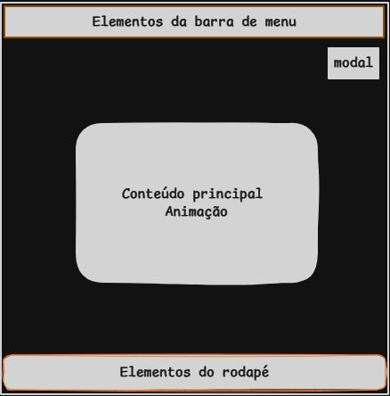

## 🌐
[](README.md)  
[](README_en.md)

---

## Nome do Projeto

Projeto - Animação na forma de Bouncing Ball

O projeto representa a continuidade dos estudados voltados ao desenvolvimento front-end de páginas web, por isso, deve ser considerado como parte de uma longa caminhada no desenvolvimento web.

Esta página foi criada com HTML5, CSS3 e JS, como parte do meu aprendizado.
A mesma representa uma animação simples controlada via JS e com isso é possível alterar as propriedades do CSS3, passando ao usuário final a noção de que a bola percorre o retângulo e cada colisão com um dos lados ela sofre modificação na velocidade e também na sua direção.
É a primeira vez que experimento o desenvolvimento de uma lógica de programação que crie uma animação, ao invés de importar uma pronta. Assim como o desenvolvimento e entendimento da lógica de um modal no que diz respeito ao seu objetivo, funcionalidade e praticidade. Optei por desenvolver de for customizada, pois assim fui entendendo o processo de desenvolvimento das linhas de código, além de me proporcionar o total controle das ações. Pois existem frameworks como o Bootstrap que entregam modal bem melhor que este, porém, para utilizar isso mais para o futuro, na minha visão, é melhor primeiramente entender qual é o fundamento que rege esse elemento por assim dizer. 

---

## Layout da Página



---

## Funcionalidades

- [Funcionalidades detalhadas do Script em JS](./src/README_js_explicacao.md)
  
- [Funcionalidades detalhadas da Estilização em CSS3](./src/README_css_explicacao.md)

---

## Tecnologias Utilizadas

- Software - Visual Studio Code (escrever o código);
- HTML5 (estrutura do site);
- CSS3 (estilização do site);
- JS (lógica para integração com o usuário final);
- Git (para interagir entre local e remoto, via linha de comando);
- [GitHub Pages](https://pages.github.com/) (para hospedar o site de maneira gratuita).

---

## Fluxograma 

```mermaid
graph TD
    A[Início] --> B[CSS3 estiliza a página e define os parâmetros para a animação e o modal]
    B --> C[JS controla como a animação irá se comportar]
    C --> D[Implementação do Modal desenvolvido em JS]
    D --> E{JS controla e manipula permitindo a interação do usuário final quando o mesmo clica em: Sobre e Funcionalidade, abrindo assim na tela os respectivos modais com uma breve descrição}
    E -->|Clique| F[Quando um modal sofre ação do clique o outro é automaticamente fechado, caso esteja aberto. Se o usuário clicar na parte do backdrop ou 'x' é possível fechar o modal]
    E -->|Padrão Comportamental| G[Após iniciar, animação entra em loop]
```



---

## Estruturação das pastas no repositório
```
beginner-bouncing-ball-animation/  # Repositório
├── Bouncing_Ball_Animation/       # Pasta Principal
│   ├── index.html                 # Página principal
│   ├── src/                       # Subpasta principal
│       ├── css/                   # Subpasta de estilização
        ├── assets/                # Subpasta secundária           
│           ├── favicon_io/        # Subpasta do ícone
            ├── fonts/             # Subpasta da fonte         
│       ├── js/                    # Subpasta do script
        ├── README_css_explicacao.md 
        ├── README_js_explicacao.md    
└── README.md (pt-BR/en)
```

---

## Observação

O framework - Bootstrap poderia ter sido escolhido, pois o mesmo já disponibiliza uma estrutura bem defina e testada para modal. Mas como optei por não utilizar via framework, acabei tendo alguns problemas de implementação enquanto ia desenvolvendo o mesmo. O principal problema foi em entender como a funcionalidade seria aplicada, principalmente na hora de abrir e fechar e como isso iria manipular as propriedades presentes no CSS3.
Outra dificuldade foi relacionada a animação que não estava ativando, pois acabei deixando uma função dentro de outra função, depois de alguns testes entendi que esse era o problema, já que com o código em si, não estava mostrando nenhum erro. 

---