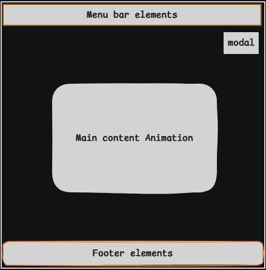
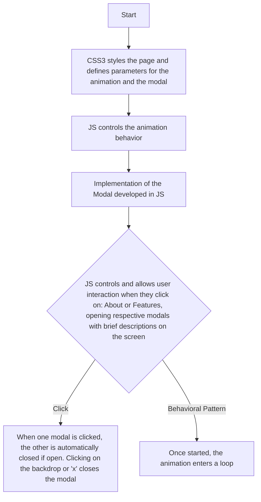

## 🌐
[](README.md)  
[](README_en.md)

---

# Project Name

Project - Bouncing Ball Animation

This project represents the continuation of studies focused on front-end web development. Therefore, it should be considered as part of a long journey in web development.

This page was created using HTML5, CSS3, and JS as part of my learning process.
It represents a simple animation controlled via JS, making it possible to modify CSS3 properties, giving the end-user the impression that the ball moves within the rectangle. Each collision with one of the sides changes its speed and direction.
This is my first experience developing programming logic to create an animation instead of importing a pre-made one. It also involves developing and understanding the logic of a modal, including its purpose, functionality, and practicality. I opted to develop a custom modal to better understand the development process and have full control over its actions. While frameworks like Bootstrap offer better modal implementations, I believe it’s essential to first understand the underlying principles of such components before relying on them in the future.

---

## Page Layout



---

## Features

- [Detailed JS Script Features](./src/README_js_explicacao.md)
  
- [Detailed CSS3 Styling Features](./src/README_css_explicacao.md)

---

## Technologies Used

- Software - Visual Studio Code (to write the code);
- HTML5 (website structure);
- CSS3 (website styling);
- JS (logic for user interaction);
- Git (to interact between local and remote repositories via command line);
- [GitHub Pages](https://pages.github.com/) (to host the website for free).

---

## Flowchart



---

## Repository Folder Structure

```
beginner-bouncing-ball-animation/  # Repository
├── Bouncing_Ball_Animation/       # Main folder
│   ├── index.html                 # Main page
│   ├── src/                       # Main subfolder
│       ├── css/                   # Styling subfolder
        ├── assets/                # Secondary subfolder           
│           ├── favicon_io/        # Icon subfolder
            ├── fonts/             # Fonts subfolder         
│       ├── js/                    # Script subfolder
        ├── README_css_explicacao.md 
        ├── README_js_explicacao.md    
└── README.md (pt-BR/en)
```

---

## Note

The framework - Bootstrap could have been used, as it provides a well-defined and tested modal structure. However, I chose not to use a framework, which led to some implementation challenges during development. The main challenge was understanding how to apply the functionality, especially regarding opening and closing the modal and how it would manipulate CSS3 properties. 
Another difficulty was related to the animation not triggering. This issue was due to having one function inside another. After some testing, I realized that was the problem, as there were no errors displayed in the code itself.

---