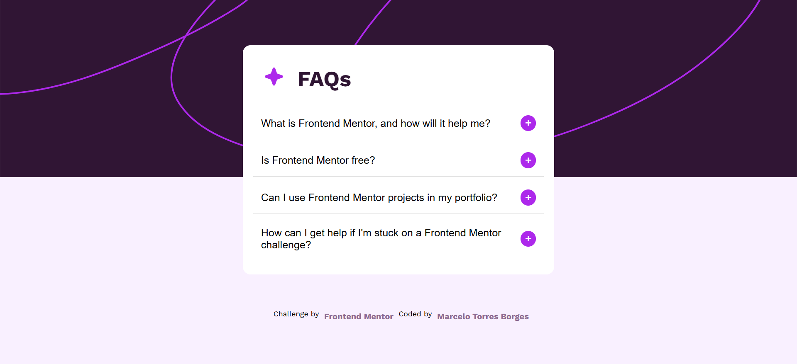
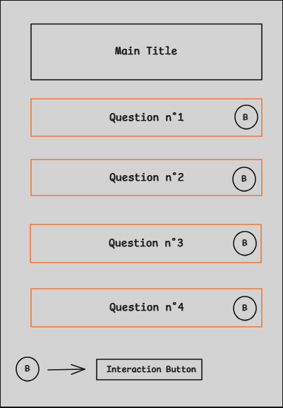
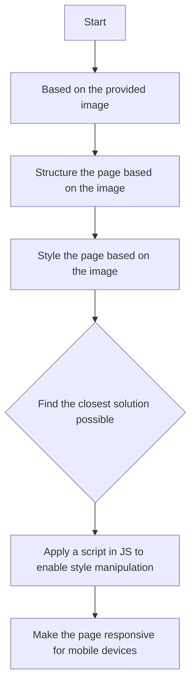

## 🌐
[](README.md)  
[](README_en.md)

---

# Project Name

FAQ

---

## Table of Contents

  - [About](#about)
  - [Page Screenshot](#page-screenshot)
  - [Layout Sketch](#layout-sketch)
  - [Project Folder Structure](#project-folder-structure)
  - [Development](#development)
    - [Flowchart](#flowchart)
    - [Technologies Used](#technologies-used)
    - [Features](#features)
    - [Notes](#notes)

---

## About

The project presents a simple and static page of a FAQ (Frequently Asked Questions) section containing five frequently asked questions from users, along with their respective answers. It serves as a solution to the challenge proposed by the Frontend Mentor website [FAQ accordion challenge on Frontend Mentor](https://www.frontendmentor.io/challenges/faq-accordion-wyfFdeBwBz).

---

## Page Screenshot



---

## Layout Sketch



---

## Project Folder Structure
```
frontend-learning-path/                      # Repository
├── FAQ_Accordion/                           # Main project folder
│   ├── index.html                           # Main page
│   ├── src/                                 # Main subfolder
│       ├── css/                             # Styling subfolder
│            ├── README_css_explicacao.md 
│            ├── README_css_explicacao_en.md   
│        ├── assets/                         # Secondary subfolder          
│           ├── images/                      # Image subfolder
│            ├── font/                       # Font subfolder         
│       ├── js/                              # Subfolder for programming logic
│            ├── README_js_explicacao.md
│            ├── README_js_explicacao_en.md 
         
└── README.md             
└── README_en.md
```
---

## Development

#### Flowchart


---

#### Technologies Used

- Software -  Visual Studio Code (for writing/editing code);
- HTML5 (page structure);
- CSS3 (page styling);
- JS (programming logic for page interaction);
- Git (to interact between local and remote repositories via command line);
- [GitHub Pages](https://pages.github.com/) (to host the site for free).

---

#### Features

- [README - CSS3 explanations](./src/css/README_css_explicacao_en.md)
- [README - JS explanations](./src/js/README_js_explicacao_en.md)

---

#### Notes

This is the third time I’ve completed an exercise proposed by **Frontend Mentor**. Since the challenge consisted of replicating a page from an image, it allowed me to put into practice all the knowledge I’ve acquired so far (I’m still at the beginning of my journey).

I faced some challenges, such as correctly centering the content on the page and dividing the background images so one would be positioned at the top and the other at the bottom without overlapping. Additionally, I believe the spacing between the elements wasn’t exactly as in the original design. This happens because, when working with a reference image, it’s not possible to measure the spacing with absolute precision. Nevertheless, I tried to get as close as possible to the proposed design.

This exercise was extremely valuable in helping me better understand the process of transforming a layout into code. I learned to:

- Choose **HTML** tags that make semantic sense for each element;
- Properly position elements within the page structure;
- Style the layout using **CSS**, applying parameters like margins, paddings, colors, fonts, and animations when hovering over specific elements;
- Use programming logic with **JS** to manipulate the styles of elements and add interactivity through actions (e.g., mouse clicks) performed by the end user;
- Implement basic SEO (Search Engine Optimization) practices, even if still at an introductory level.