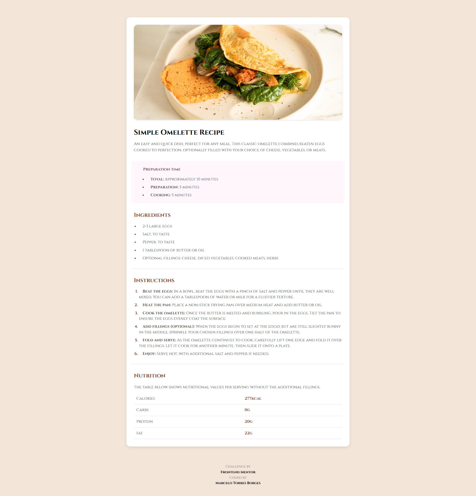
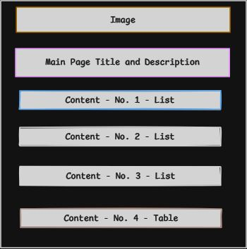

## 🌐
[](README.md)  
[](README_en.md)

---

# Project Name

Recipe Page

---

## Table of Contents

  - [About](#about)
  - [Page Screenshot](#page-screenshot)
  - [Layout Sketch](#layout-sketch)
  - [Project Folder Structure](#project-folder-structure)
  - [Development](#development)
    - [Flowchart](#flowchart)
    - [Technologies Used](#technologies-used)
    - [Features](#features)
    - [Notes](#notes)

---

## About

This project showcases a simple and static recipe page. It describes the preparation time, ingredients, and steps necessary to cook an omelet, as well as providing general nutritional information about the dish. This is a solution to a challenge proposed by Frontend Mentor: [Recipe page challenge on Frontend Mentor](https://www.frontendmentor.io/challenges/recipe-page-KiTsR8QQKm).

---

## Page Screenshot



---

## Layout Sketch



---

## Project Folder Structure
```
frontend-learning-path/       # Repository
├── Recepi_Page/              # Main project folder
│   ├── index.html            # Main page
│   ├── src/                  # Main subfolder
│       ├── css/              # Styling subfolder
            ├── README_css_explicacao.md 
            ├── README_css_explicacao_en.md   
        ├── assets/           # Secondary subfolder          
│           ├── images/       # Image subfolder
            ├── font/         # Font subfolder         
│              
└── README.md             
└── README_en.md
```
---

## Development

#### Flowchart

```mermaid
graph TD
    A[Start] --> B[Based on the provided image]
    B --> C[Structure the page based on the image]
    C --> D[Style the page based on the image]
    D --> E{Find the closest solution possible}
    E --> F[Make the page responsive for mobile devices]
```
---

#### Technologies Used

- Software -  Visual Studio Code (for writing/editing code);
- HTML5 (page structure);
- CSS3 (page styling);
- Git (to interact between local and remote repositories via command line);
- [GitHub Pages](https://pages.github.com/) (to host the site for free).

---

#### Funcionalidades

- [README - CSS3 explanations](./src/css/README_css_explicacao_en.md)

---

#### Notes

This was my first time solving a challenge proposed by **Frontend Mentor**. The task consisted of replicating a page based on an image, which allowed me to put into practice all the knowledge I have acquired so far (I am still at the beginning of my learning journey).

I faced some difficulties, such as finding the exact font used in the design. While I was able to identify the original font, it was a paid option, so I chose a free alternative available on **Google Fonts**. Additionally, I believe the spacing between elements may not be completely accurate, as working from an image reference does not provide absolute precision for all element spacings. Nonetheless, I aimed to get as close as possible to the proposed design.

This exercise was extremely valuable for understanding the process of turning a layout into code. I learned to:

Choose **HTML** tags that make semantic sense for each element;
Correctly position elements within the page structure;
Style the layout using **CSS**, applying parameters such as margins, paddings, colors, fonts, and alignments.