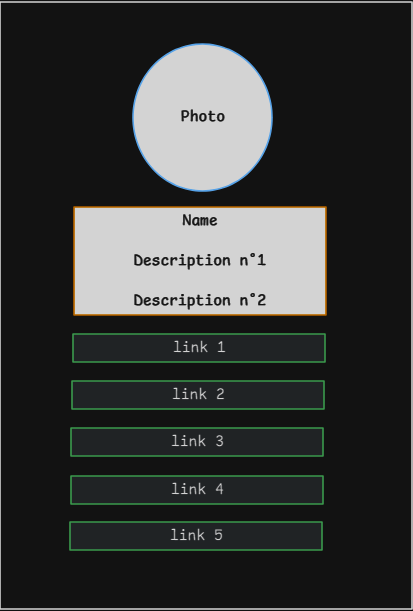

## 🌐
[](README.md)  
[](README_en.md)

---

# Project Name

Social links profile

---

## Table of Contents

  - [About](#about)
  - [Page Screenshot](#page-screenshot)
  - [Layout Sketch](#layout-sketch)
  - [Project Folder Structure](#project-folder-structure)
  - [Development](#development)
    - [Flowchart](#flowchart)
    - [Technologies Used](#technologies-used)
    - [Features](#features)
    - [Notes](#notes)

---

## About

The project features a simple and static page presenting a "card" that includes a photo, a brief description, and links to five different social profiles. This is a solution to a challenge proposed by Frontend Mentor: [Social links profile challenge on Frontend Mentor](https://www.frontendmentor.io/challenges/social-links-profile-UG32l9m6dQ).

---

## Page Screenshot


---

## Layout Sketch



---

## Project Folder Structure
```
frontend-learning-path/                     # Repository
├── Social_links_profile_main/              # Main project folder
│   ├── index.html                          # Main page
│   ├── src/                                # Main subfolder
│       ├── css/                            # Styling subfolder
            ├── README_css_explicacao.md 
            ├── README_css_explicacao_en.md   
        ├── assets/                         # Secondary subfolder          
│           ├── images/                     # Image subfolder
            ├── font/                       # Font subfolder         
│              
└── README.md             
└── README_en.md
```
---

## Development

#### Flowchart


---

#### Technologies Used

- Software -  Visual Studio Code (for writing/editing code);
- HTML5 (page structure);
- CSS3 (page styling);
- Git (to interact between local and remote repositories via command line);
- [GitHub Pages](https://pages.github.com/) (to host the site for free).

---

#### Funcionalidades

- [README - CSS3 explanations](./src/css/README_css_explicacao_en.md)

---

#### Notes

This was my first time solving a challenge proposed by **Frontend Mentor**. The task consisted of replicating a page based on an image, which allowed me to put into practice all the knowledge I have acquired so far (I am still at the beginning of my learning journey).

I faced some difficulties, such as properly center the content on the page and make the image border circular. Additionally, I believe the spacing between elements may not be completely accurate, as working from an image reference does not provide absolute precision for all element spacings. Nonetheless, I aimed to get as close as possible to the proposed design.

This exercise was extremely valuable for understanding the process of turning a layout into code. I learned to:

- Choose **HTML** tags that make semantic sense for each element;
- Correctly position elements within the page structure;
- Style the layout using CSS, applying parameters such as margins, paddings, colors, fonts, and animations when the cursor hovers over a specific element;
- Implement more SEO (Search Engine Optimization) practices, even if they are still basic.

---