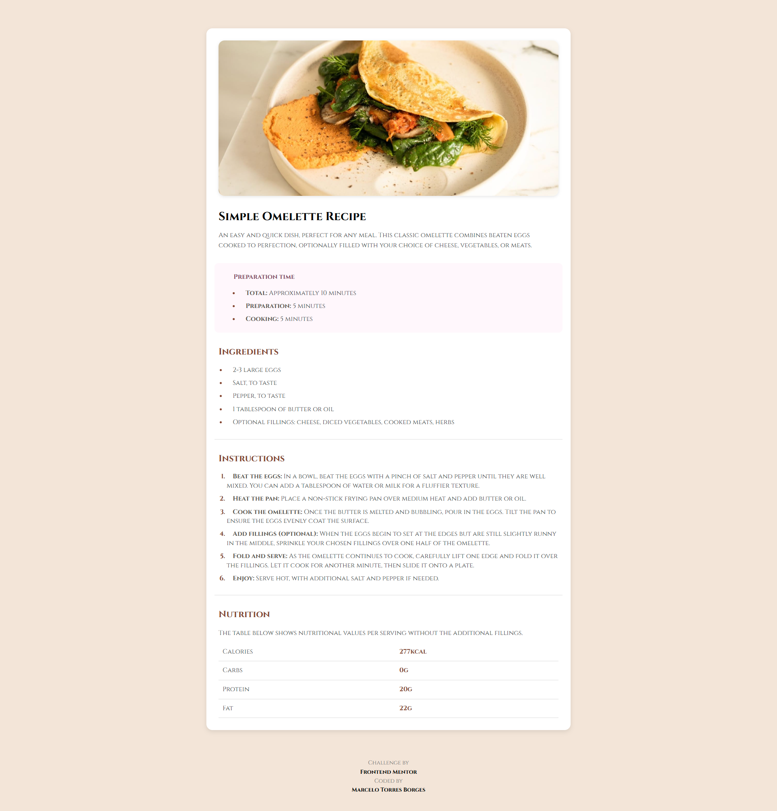
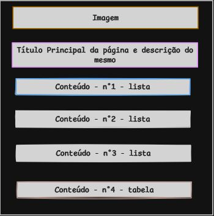
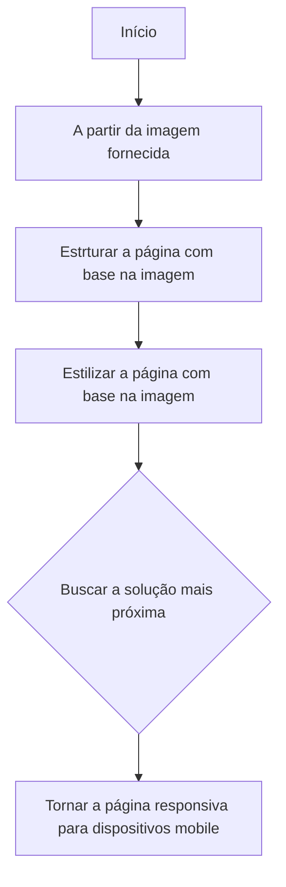

## 🌐
[](README.md)  
[](README_en.md)

---

# Nome do Projeto 

Página de Receita 

---

## Sumário

  - [Sobre](#sobre)
  - [Foto da Página](#foto-da-página)
  - [Esboço do Layout](#esboço-do-layout)
  - [Estruturação das pastas do projeto](#estruturação-das-pastas-do-projeto)
- [Desenvolvimento](#desenvolvimento)
  - [Fluxograma](#fluxograma)
  - [Tecnologias Utilizadas](#tecnologias-utilizadas)
  - [Funcionalidades](#funcionalidades)
  - [Observações](#observações)

---

## Sobre

O projeto aborda uma página simples e estática de uma receita, aqui no caso, descreve o tempo de preparo, os itens, etapas necessárias para cozinhar um Omelete, além de informar de maneira geral a parte nutricional do prato. O mesmo é uma solução ao desafio proposto pelo site do Frontend Mentor [Recipe page challenge on Frontend Mentor](https://www.frontendmentor.io/challenges/recipe-page-KiTsR8QQKm).

---

## Foto da Página



---

## Esboço do Layout



---

## Estruturação das pastas do projeto
```
frontend-learning-path/       # Repositório
├── Recepi_Page/              # Pasta Principal do projeto
│   ├── index.html            # Página principal
│   ├── src/                  # Subpasta principal
│       ├── css/              # Subpasta de estilização
            ├── README_css_explicacao.md 
            ├── README_css_explicacao_en.md   
        ├── assets/           # Subpasta secundária           
│           ├── images/       # Subpasta de imagens
            ├── font/         # Subpasta da fonte         
│              
└── README.md             
└── README_en.md
```
---

## Desenvolvimento

#### Fluxograma


---

#### Tecnologias Utilizadas

- Software - Visual Studio Code (escrever/editar o código);
- HTML5 (estrutura da página);
- CSS3 (estilização da página);
- Git (para interagir entre local e remoto, via linha de comando);
- [GitHub Pages](https://pages.github.com/) (para hospedar o site de maneira gratuita).

---

#### Funcionalidades

- [README - CSS3 explicações](./src/css/README_css_explicacao.md)

---

#### Observações

Foi a primeira vez que resolvi um exercício proposto pelo **Frontend Mentor**. Como o desafio consistia em replicar uma página a partir de uma imagem, isso permitiu colocar em prática todo o aprendizado adquirido até o momento (ainda estou no início da jornada).

Enfrentei algumas dificuldades, como encontrar a fonte utilizada no design. Apesar de ter identificado a fonte original, ela era paga, então optei por utilizar uma alternativa gratuita disponível no **Google Fonts**. Além disso, acredito que os espaçamentos entre os elementos não ficaram exatamente como no design original. Isso ocorre porque, ao trabalhar com uma imagem de referência, não é possível medir os espaçamentos com precisão absoluta. Ainda assim, busquei chegar o mais próximo possível do proposto.

Esse exercício foi extremamente valioso para entender melhor o processo de transformar um layout em código. Aprendi a:
- Escolher tags **HTML** que façam sentido semântico para cada elemento;
- Posicionar os elementos corretamente na estrutura da página;
- Estilizar o layout utilizando **CSS**, aplicando parâmetros como margens, paddings, cores, fontes e alinhamentos.


